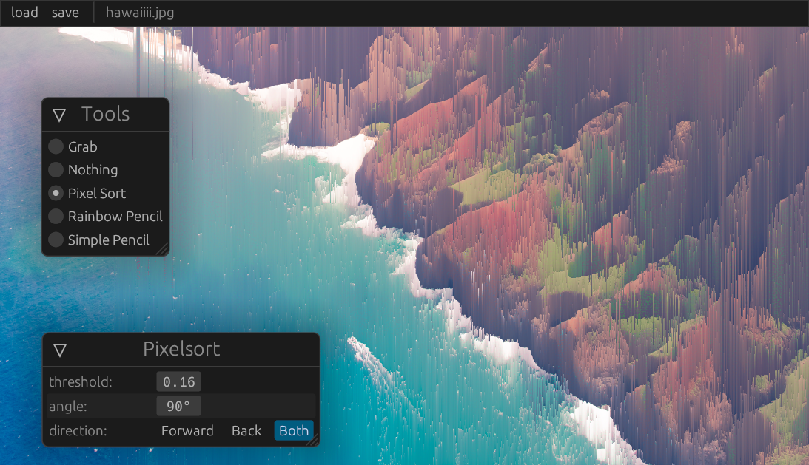

# img-editor-bevy
A small simple image editor written in Rust using the Bevy game-engine. I made this mainly to learn the tools, and possibly in the future, to implement personal image editing effects on.

## Building
Like most other Rust crates, simply `cargo run`. The libraries used should be cross-platform.
